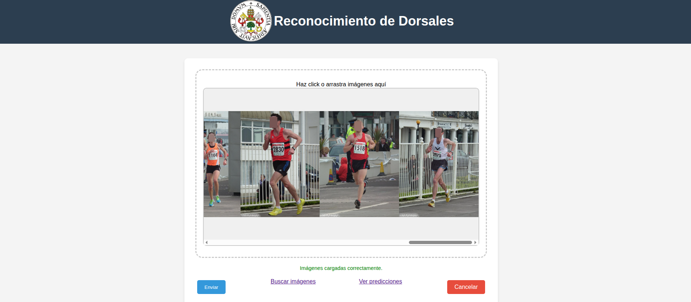
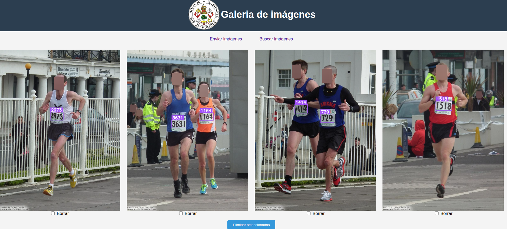

# Computer Vision Applied to Bib Number Detection and Recognition in Sports Competitions

This project is based on a final degree project (TFG) in Computer Science at the University of Valladolid.

## Project Summary

The goal of this project is to develop a bib number recognition system, along with a web application to test its functionality. This application allows users to upload images to the recognition system, search images by bib number, and view the predictions made by the recognizer.

## Using the Application

When the application starts, it displays a screen from which images can be sent to the bib number recognition system. Additionally, users can navigate to other sections to search images by bib number and view the predictions made by the model.



In the search screen, images can be filtered by the bib numbers they contain.


In the display screen, the predictions generated by the model are shown, allowing evaluation of its performance on specific images. There is also an option to delete images from the system.



## Results

For the bib number recognition model, 904 images containing a total of 1,518 bib numbers were used. The model was developed using YOLOv11n together with PaddleOCR. In tests conducted using a 3-fold cross-validation scheme, an F1-score of 0.839 was achieved on the test sets.

## Requirements

- [Docker](https://www.docker.com/) installed.

## Installing the Application

Follow these steps to clone the repository, build the Docker image, and run the application:

```bash
git clone https://github.com/dipualo/bib_number_recognition_app.git
cd app_reconocimiento_dorsales
docker build -t bib_number_recognition_app .
docker run -it --rm -p 5000:5000 bib_number_recognition_app
```

## Author and Contact

**Author:** Diego de la Puente Alonso  
**Email:** [diego@delapuente.es](mailto:diego@delapuente.es)