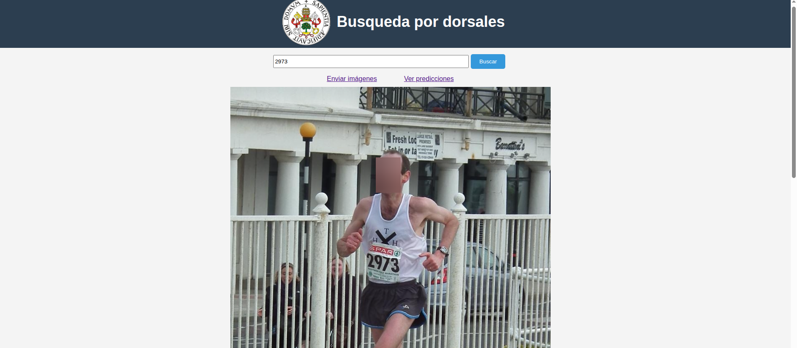

# Visión Artificial aplicada a la detección y reconocimiento de dorsales en competiciones deportivas

Este proyecto está basado en un TFG de infórmatica de la univerisidad de Valladolid.

## Resumen del proyecto

A partir de este proyecto, se busca desarrollar un sistema de reconocimiento de dorsales, junto con una aplicación web que permita comprobar su funcionamiento. Dicha aplicación permitirá enviar imágenes al sistema de reconocimiento, buscar imágenes por número de dorsal y visualizar las predicciones realizadas por el reconocedor.

## Uso de la aplicación

Al iniciar la aplicación, se muestra una pantalla desde la cual se pueden enviar imágenes al sistema de reconocimiento de dorsales. Además, es posible navegar hacia otras secciones para buscar imágenes por número de dorsal y visualizar las predicciones realizadas por el modelo.


En la pantalla de búsqueda, se pueden localizar imágenes filtrándolas por los dorsales que contengan.



En la pantalla de visualización, se muestran las predicciones generadas por el modelo, lo que permite evaluar su rendimiento sobre imágenes específicas. También se ofrece la opción de borrar imágenes del sistema.


## Resultados

Se ha utilizado utiliza para crear el modelo de reconocimiento de dorsales 904 imágenes con 1518 dorsales. Este modelo se ha creado usando YOLOv11n y paddleOCR y
se alcanza un valor de F1-score de 0,839 en los conjuntos de test de un 3 k-fold. 

## Requisitos

- Tener [Docker](https://www.docker.com/) instalado.

## Instalar aplicación

Sigue los siguientes pasos para clonar el repositorio, construir la imagen de Docker y ejecutar la aplicación:

```bash
git clone https://github.com/dipualo/app_reconocimiento_dorsales.git
cd app_reconocimiento_dorsales
docker build -t app_reconocedor_dorsales .
docker run -it --rm -p 5000:5000 app_reconocedor_dorsales
```

## Autor y contacto

**Autor:** Diego de la Puente Alonso  
**Correo electrónico:** [diego@delapuente.es](mailto:diego@delapuente.es)
